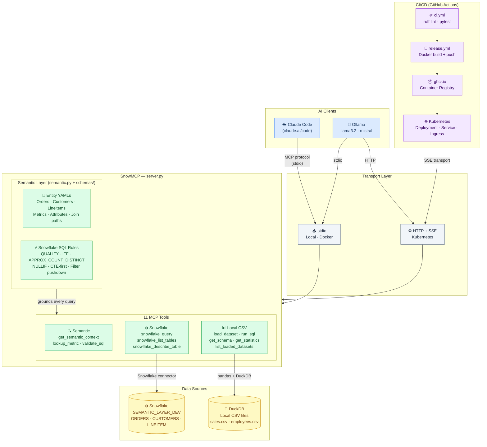

# SnowMCP

An AI-native data analytics layer built on the [Model Context Protocol](https://modelcontextprotocol.io). Connects Claude and Ollama to Snowflake and local CSV datasets through a semantic layer — delivering consistent, Snowflake-optimised SQL without hallucinated column names or inconsistent metric definitions.

**What makes it different from Snowflake Cortex Analyst:** model flexibility (Claude or any Ollama model), local CSV querying alongside Snowflake, and full ownership of the semantic model and deployment.

---

## Architecture



On startup the server loads entity YAML schemas (`schemas/`), which define tables, canonical metric formulas, join relationships, and Snowflake-specific SQL rules. Every query Claude or Ollama generates is grounded in this model — the same way Cortex Analyst uses its semantic model.

---

## Prerequisites

| Requirement | Notes |
|-------------|-------|
| Python 3.12+ | `python --version` |
| Snowflake account | Credentials in `.env` (see below) |
| Ollama | Optional — for local LLM chat |
| Docker | Optional — for containerised dev/prod |
| kubectl | Optional — for Kubernetes deployment |

---

## Environment variables

```bash
cp .env.example .env   # then fill in your credentials
```

| Variable | Description |
|----------|-------------|
| `SNOWFLAKE_ACCOUNT` | Account identifier (e.g. `abc123-xy12345`) |
| `SNOWFLAKE_USER` | Snowflake username |
| `SNOWFLAKE_PASSWORD` | Snowflake password |
| `SNOWFLAKE_WAREHOUSE` | Warehouse name (e.g. `COMPUTE_WH`) |
| `SNOWFLAKE_DATABASE` | Default database |
| `SNOWFLAKE_SCHEMA` | Default schema (e.g. `PUBLIC`) |
| `SNOWFLAKE_ROLE` | Snowflake role (e.g. `ACCOUNTADMIN`) |
| `MCP_TRANSPORT` | `stdio` (default) or `sse` (Kubernetes) |
| `PORT` | HTTP port when `MCP_TRANSPORT=sse` (default `8000`) |
| `OLLAMA_MODEL` | Default Ollama model (default `llama3.2`) |

---

## Quick start — Claude Code (MCP)

The server is registered in `~/.claude.json` under the project path. Claude Code spawns it automatically when you open the project.

**To register it manually** (one-time):

```bash
claude mcp add data-engineering python /path/to/data-mcp-server/server.py
```

**To restart after code changes** — open a new Claude Code conversation, or run `/mcp` in the chat to reconnect.

**Verify it's working** — ask Claude:
> "What are the available metrics?" or "What is total revenue by customer segment?"

---

## Semantic layer

The semantic layer lives in `schemas/` as entity YAML files. Each file defines one table's columns, canonical metric formulas, and join relationships.

**Add a new metric** — edit the relevant YAML:

```yaml
metrics:
  - name: fulfilled_revenue
    display_name: Fulfilled Revenue
    aggregation: SUM
    source_field: o_totalprice
    granularity: orders
    filter: "o_orderstatus = 'F'"   # optional WHERE predicate
```

**Add a new entity** — create `schemas/my_table.yaml`:

```yaml
type: entity
name: my_table
display_name: My Table
source: MY_DB.PUBLIC.MY_TABLE
keys:
  - id_column
attributes:
  - name: category
    source_field: category_col
metrics:
  - name: my_metric
    aggregation: SUM
    source_field: value_col
    granularity: my_table
relations:
  - target_entity: orders
    rel_type: many-to-one
    join_on:
      - source_field: order_id
        target_field: o_orderkey
```

No code changes needed — `server.py` picks up new YAML files automatically on restart.

**Snowflake SQL optimisation rules** are also embedded in every session's system prompt (defined in `semantic.py`): `APPROX_COUNT_DISTINCT`, `QUALIFY` for window functions, `IFF` over `CASE WHEN`, `NULLIF` in divisions, early filter pushdown, and correct join ordering.

---

## Run locally (Python)

```bash
pip install -r requirements.txt
python server.py          # stdio mode — used by Claude Code
```

SSE mode (HTTP, needed for Ollama `--sse` or Kubernetes):

```bash
MCP_TRANSPORT=sse python server.py
# Listening on http://0.0.0.0:8000
```

---

## Run with Docker

```bash
# Build
docker build -t snowmcp .

# stdio (Claude Code)
docker run -i --rm --env-file .env snowmcp

# SSE (Ollama / remote)
docker run --rm --env-file .env -e MCP_TRANSPORT=sse -p 8000:8000 snowmcp
```

**docker-compose** (local dev, SSE mode):

```bash
docker-compose up
```

To use the Docker image with Claude Code, update the MCP entry in `~/.claude.json`:

```json
"data-engineering": {
  "type": "stdio",
  "command": "docker",
  "args": ["run", "-i", "--rm",
    "-e", "SNOWFLAKE_ACCOUNT", "-e", "SNOWFLAKE_USER", "-e", "SNOWFLAKE_PASSWORD",
    "-e", "SNOWFLAKE_WAREHOUSE", "-e", "SNOWFLAKE_DATABASE", "-e", "SNOWFLAKE_SCHEMA",
    "-e", "SNOWFLAKE_ROLE", "ghcr.io/<your-github-username>/snowmcp:latest"],
  "env": { "SNOWFLAKE_ACCOUNT": "...", "SNOWFLAKE_USER": "...", "..." : "..." }
}
```

---

## Chat via Ollama

Run a local LLM that queries your data through MCP tools, grounded by the semantic layer.

```bash
# Install Ollama — https://ollama.com
ollama pull llama3.2

# stdio (server spawned automatically — simplest)
python ollama_client.py

# SSE (connect to a running server)
MCP_TRANSPORT=sse python server.py &                          # terminal 1
python ollama_client.py --sse http://localhost:8000/sse       # terminal 2

# Use a different model
python ollama_client.py --model mistral
OLLAMA_MODEL=llama3.2 python ollama_client.py
```

On startup the client calls `get_semantic_context` and injects the full data model into the system prompt, so the LLM knows all table schemas, canonical metrics, and join paths before the first question.

---

## Kubernetes deployment

### 1. Build and push the image

```bash
docker build -t ghcr.io/<your-github-username>/snowmcp:latest .
docker push ghcr.io/<your-github-username>/snowmcp:latest
```

### 2. Create the Snowflake secret

```bash
kubectl create secret generic snowflake-credentials \
  --from-literal=account="$SNOWFLAKE_ACCOUNT" \
  --from-literal=user="$SNOWFLAKE_USER" \
  --from-literal=password="$SNOWFLAKE_PASSWORD" \
  --from-literal=warehouse="$SNOWFLAKE_WAREHOUSE" \
  --from-literal=database="$SNOWFLAKE_DATABASE" \
  --from-literal=schema="$SNOWFLAKE_SCHEMA" \
  --from-literal=role="$SNOWFLAKE_ROLE"
```

### 3. Deploy

```bash
kubectl apply -f k8s/deployment.yaml
kubectl apply -f k8s/service.yaml
kubectl rollout status deployment/data-mcp-server
```

### 4. Test via port-forward

```bash
kubectl port-forward svc/data-mcp-server 8000:80
python ollama_client.py --sse http://localhost:8000/sse
```

### 5. External access (optional)

Uncomment and configure `k8s/ingress.yaml`, then:

```bash
kubectl apply -f k8s/ingress.yaml
```

---

## GitHub CI/CD setup

### 1. Push to GitHub

```bash
git remote add origin https://github.com/<your-username>/snowmcp.git
git push -u origin main
```

### 2. Set GitHub Secrets

Go to **Settings → Secrets and variables → Actions** and add:

| Secret | Value |
|--------|-------|
| `KUBE_CONFIG` | `cat ~/.kube/config \| base64` |
| `SNOWFLAKE_ACCOUNT` | e.g. `szsnrvm-ls09988` |
| `SNOWFLAKE_USER` | Snowflake username |
| `SNOWFLAKE_PASSWORD` | Snowflake password |
| `SNOWFLAKE_WAREHOUSE` | e.g. `COMPUTE_WH` |
| `SNOWFLAKE_DATABASE` | e.g. `SEMANTIC_LAYER_DEV` |
| `SNOWFLAKE_SCHEMA` | e.g. `PUBLIC` |
| `SNOWFLAKE_ROLE` | e.g. `ACCOUNTADMIN` |

### 3. What runs automatically

| Event | Workflow | What it does |
|-------|----------|-------------|
| Push / PR (any branch) | `ci.yml` | Lint (ruff) + run all tests |
| Push to `main` | `release.yml` | Build Docker image → push to `ghcr.io` → `kubectl apply` |

### 4. Run tests locally

```bash
pip install -r requirements.txt
pytest
```

---

## Available MCP tools

### Semantic layer tools
| Tool | When to use |
|------|-------------|
| `get_semantic_context` | Start of any Snowflake session — loads full data model into context |
| `lookup_metric` | Before any aggregation — returns exact SQL formula for a business term |
| `validate_sql` | Before `snowflake_query` — runs EXPLAIN to catch errors without scanning data |

### Snowflake tools
| Tool | Description |
|------|-------------|
| `snowflake_query` | Run Snowflake-optimised SQL and return results |
| `snowflake_list_tables` | List tables in the connected database/schema |
| `snowflake_describe_table` | Column names and types for a Snowflake table |

### Local CSV tools
| Tool | Description |
|------|-------------|
| `load_dataset` | Load a CSV file into memory and return a preview |
| `get_schema` | Column names, types, and null counts |
| `get_statistics` | Descriptive statistics (min/max/mean/std/quartiles) |
| `run_sql` | Run DuckDB SQL against a loaded dataset |
| `list_loaded_datasets` | List all datasets currently in memory |
